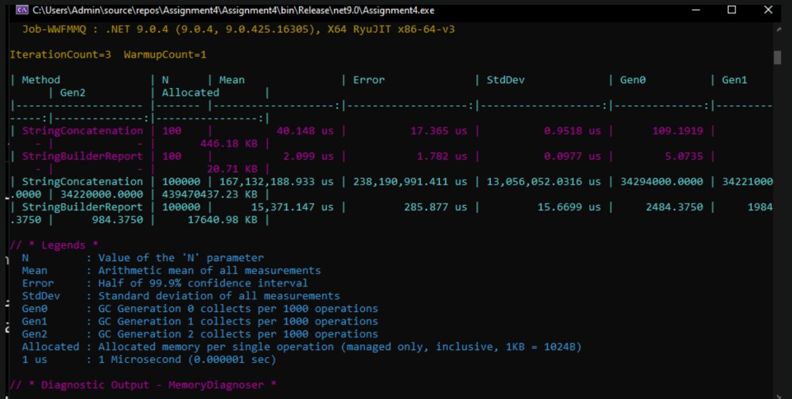

# string vs StringBuilder Benchmark

## Provided BenchmarkDotNet results

The following table is transcribed from the student's uploaded BenchmarkDotNet screenshot. These are existing results from the student's run, not measurements generated during this review.

The screenshot identifies .NET 9.0.4, X64 RyuJIT, one warmup and three measurement iterations. The original parameter name was `N` and the original StringBuilder method name was `StringBuilderReport`. In the corrected source, these names are `Iterations` and `StringBuilderConcatenation`; the measured append logic is unchanged.

| Method in original run | N | Mean (µs) | Error (µs) | StdDev (µs) | Allocated (KB) |
| --- | ---: | ---: | ---: | ---: | ---: |
| StringConcatenation | 100 | 40.148 | 17.365 | 0.9518 | 446.18 |
| StringBuilderReport | 100 | 2.099 | 1.782 | 0.0977 | 20.71 |
| StringConcatenation | 100,000 | 167,132,188.933 | 238,190,991.411 | 13,056,652.0316 | 439,470,437.23 |
| StringBuilderReport | 100,000 | 15,371.147 | 285.877 | 15.6699 | 17,640.98 |

The screenshot defines allocated memory per operation with 1 KB = 1024 B. Error is the half-width of the 99.9% confidence interval. The string result at 100,000 has a large error and standard deviation; these figures describe this run and should not be treated as precise universal timings.



## Required sizes still to complete

The supplied run contains only 100 and 100,000 appends. The assignment requires 100, 1,000, 10,000 and 100,000. The corrected source now uses `[Params(100, 1000, 10000, 100000)]` with `[MemoryDiagnoser]`, but the updated benchmark has not been run in this environment, which lacks the .NET SDK.

Run from the repository root:

```bash
dotnet run --project submission/assignment/AcademyScheduleAnalyzer/AcademyScheduleAnalyzer.csproj -c Release -- --benchmark
```

Then add the complete generated summary from `BenchmarkDotNet.Artifacts/results/` for all four sizes. No measurements have been invented for the missing sizes.

## 1. Which approach was faster with 100 iterations?

StringBuilder was faster in the provided run. Its mean was 2.099 µs, compared with 40.148 µs for string concatenation.

## 2. Which approach was faster with 100,000 iterations?

StringBuilder was faster in the provided run. Its mean was 15,371.147 µs, compared with 167,132,188.933 µs for string concatenation.

## 3. Which approach allocated more memory?

String concatenation allocated more at both measured sizes. At 100 appends, it allocated 446.18 KB versus 20.71 KB for StringBuilder. At 100,000 appends, it allocated 439,470,437.23 KB versus 17,640.98 KB for StringBuilder. Allocated reports cumulative allocation during an operation, not the size of the final string or peak memory held at once.

## 4. What happened to string concatenation performance as the loop size increased?

The mean increased from 40.148 µs at 100 appends to 167,132,188.933 µs at 100,000 appends. Allocation also increased sharply. Repeatedly copying an increasingly long string makes concatenation slower as the loop grows. Results for the two intermediate sizes still need to be added.

## 5. Why does repeated string concatenation create additional allocations?

Strings are immutable. Repeated `result += Text` generally creates a new string containing the previous result plus the appended text. As the result grows, more existing content must be copied and additional memory is allocated.

## 6. Why does StringBuilder usually perform better when text is repeatedly appended?

StringBuilder stores appended text in mutable buffers and expands them when needed. It avoids copying the complete accumulated text for every append. `ToString()` still creates the final string, so StringBuilder does not eliminate all allocations.

## 7. Is StringBuilder always better than normal string operations?

No. Normal concatenation or interpolation is often simpler and efficient for a small, fixed number of operations. StringBuilder is useful for repeated appends, especially in larger loops. The better choice depends on the workload. The provided results support StringBuilder for these measured repeated-append cases.
