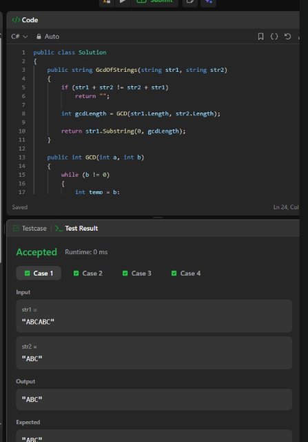

# LeetCode — Assignment 4

## LeetCode Account

Username: 7V5DqS2LTd

LeetCode Profile: https://leetcode.com/u/7V5DqS2LTd/

[Account submission file](account.md)

## 1. Valid Anagram

**Problem URL:** https://leetcode.com/problems/valid-anagram/

### C# Solution

This preserves the sorting approach shown in the supplied screenshot. The screenshot uses `SequenceEqual`; the version below replaces that LINQ call with a simple comparison loop to follow the no-LINQ instruction.

```csharp
using System;

public class Solution
{
    public bool IsAnagram(string s, string t)
    {
        if (s.Length != t.Length)
            return false;

        char[] sChars = s.ToCharArray();
        char[] tChars = t.ToCharArray();

        Array.Sort(sChars);
        Array.Sort(tChars);

        for (int i = 0; i < sChars.Length; i++)
        {
            if (sChars[i] != tChars[i])
                return false;
        }

        return true;
    }
}
```

### Explanation

**How does the solution determine whether the strings are anagrams?**

It sorts the characters of both strings, then compares the sorted arrays character by character. If all characters match, both strings contain the same characters with the same frequencies.

**What happens when the strings have different lengths?**

The function returns `false` immediately. Strings of different lengths cannot contain exactly the same character frequencies.

**How can character frequencies be compared?**

Sorting groups equal characters together. Matching the sorted arrays confirms that every character appears the same number of times. Another possible approach uses counters: increment counts for the first string, decrement them for the second, then check that all counts are zero. This solution uses sorting.

**Time complexity:** `O(n log n)` for equal-length strings of length n. Sorting dominates the linear array creation and comparison. Different lengths return immediately.

**Space complexity:** `O(n)` because two character arrays are created.

### Supplied Screenshot


The screenshot shows **Accepted under Test Result** for the pictured version. Full Submit acceptance and acceptance of the no-LINQ version above have not been verified.

## 2. Greatest Common Divisor of Strings

**Problem URL:** https://leetcode.com/problems/greatest-common-divisor-of-strings/

### C# Solution

The main method follows the visible code in the supplied screenshot. The lower part of the GCD helper is cropped in that image; the helper below completes it with the standard Euclidean algorithm. The cropped lines are not claimed to be an exact transcription of the original source.

```csharp
public class Solution
{
    public string GcdOfStrings(string str1, string str2)
    {
        if (str1 + str2 != str2 + str1)
            return "";

        int gcdLength = GCD(str1.Length, str2.Length);

        return str1.Substring(0, gcdLength);
    }

    public int GCD(int a, int b)
    {
        while (b != 0)
        {
            int temp = b;
            b = a % b;
            a = temp;
        }

        return a;
    }
}
```

### Explanation

**What does it mean for one string to divide another string?**

A string divides another string when repeating it a whole number of times produces the other string. For example, `ABC` divides `ABCABC` because repeating `ABC` twice gives `ABCABC`.

**How are repeated patterns detected?**

The solution checks whether `str1 + str2` equals `str2 + str1`. For nonempty inputs, equality shows that both strings share a repeating base pattern.

**Why do some pairs have no common divisor string?**

If the two concatenations differ, the inputs cannot be made from repetitions of the same nonempty pattern. The method returns an empty string.

**How is the greatest valid pattern found?**

A divisor pattern's length must divide both input lengths. Once pattern compatibility is confirmed, the greatest valid length is the greatest common divisor of those lengths. The method returns a prefix of that length from `str1`.

The GCD helper repeatedly replaces `(a, b)` with `(b, a % b)`. When b becomes zero, a is the greatest common divisor.

**Time complexity:** `O(m + n)`, where m and n are the input lengths. Concatenation and comparison take linear time; Euclid's algorithm takes `O(log(min(m, n)))` time and does not dominate.

**Space complexity:** `O(m + n)` because the compatibility check creates concatenated strings. The returned substring also requires storage.

### Supplied Screenshot



The screenshot shows **Accepted under Test Result**. Full Submit acceptance and execution of the completed helper above have not been verified.

## Submission Notes

- Keep these LeetCode solutions separate from the Academy Schedule Analyzer application.
- Submit each code block separately. Both use LeetCode's expected class name `Solution`; they are independent problem solutions.
- Both supplied screenshots are preserved without editing their contents.
- The corrected console project does not compile or include these Markdown code blocks.
- The actual profile URL supplied by the student is recorded in `account.md`.
